# EC2 환경 설정

AMI (Amazon Machine Image):   
- `Amazon Linux`
    
인스턴스 유형:   
- `m4.xlarge`

보안 그룹:
- `기존 보안 그룹 선택` $\rightarrow$ DE 세션에 썼던 보안 그룹 (나중에 수정해줘야됨)

- 또는, `보안 그룹 생성
    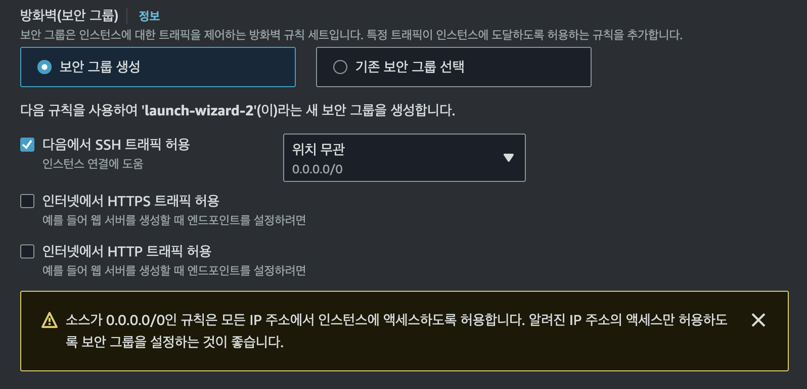

스토리지 구성:
- `40 GiB gp3`

- TSDB (Time Series Database) 특성상 적재하는 데이터가 많아 40GB로 설정 해 주었다.

인스턴스 개수:
- 1개

## 기존 DE 보안 그룹 사용 시
1. 인스턴스 $\rightarrow$ 보안 $\rightarrow$ 보안 그룹
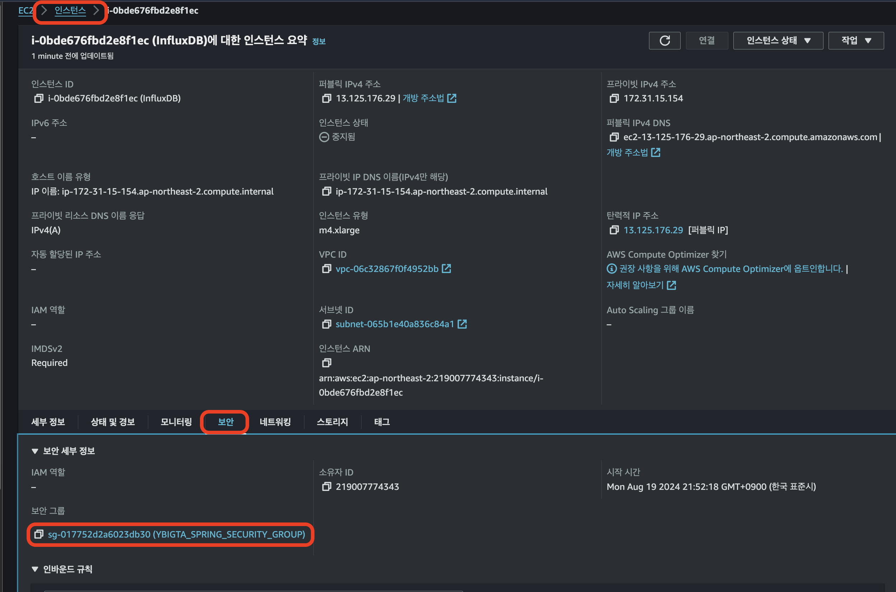

2. 인바운드 규칙 편집
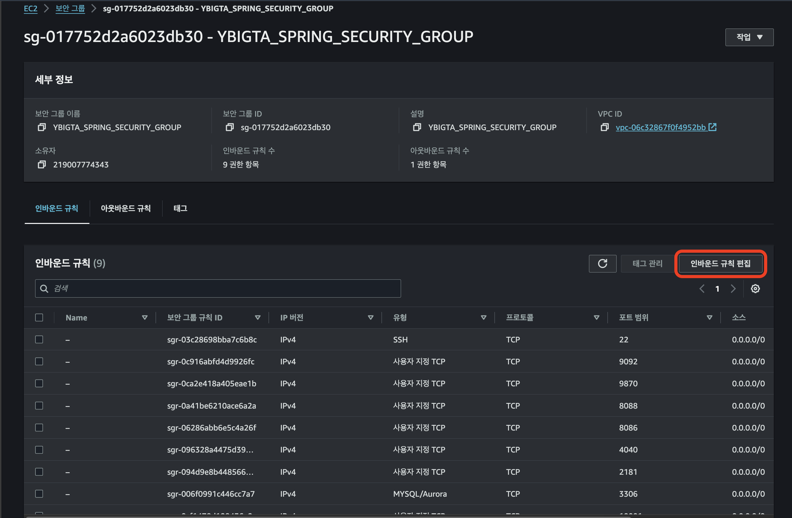

3. influxDB를 위한 port를 열어주면 된다.
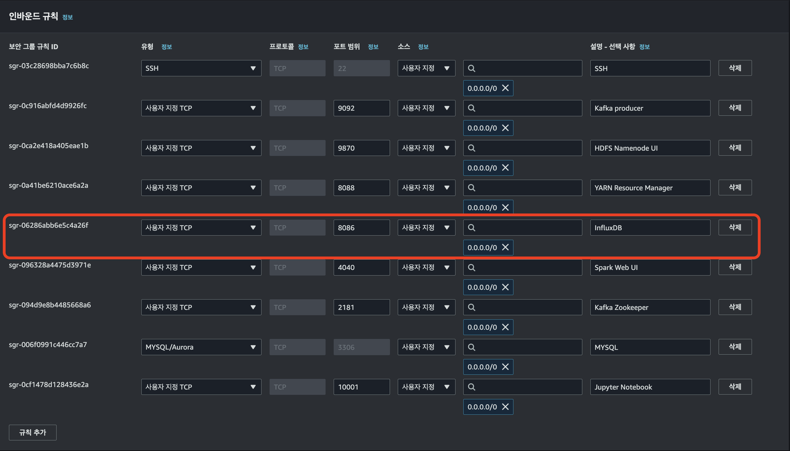

## 새 보안 그룹 생성 시
- 위 (기존 DE 보안 그룹 사용 시) 문항의 3번을 참고하여 설정해주면 된다.

# InfluxDB 환경설정
0. InfluxDB documentation:  
 https://docs.influxdata.com/influxdb/v2/install/?t=Linux

1. InfluxDB documentation에 접속하여, `x86_64.rpm`로 끝나는 파일을 `curl`명령어로 다운 받아준다. (Amazon Linux는 `# Red Hat/CentOS/Fedora x86-64 (x64, AMD64)` 이 부분에 해당되겠다)

2. 문서는 수시로 업데이트가 되어 있을 수 있으니, 문서를 참고하여 EC2에 InfluxDB를 설치해준다.

# InfluxDB 연결
1. AWS에서 InfluxDB 실행중인 EC2 선택

2. `자동 할당된 IP 주소 (Public IP)`를 복사 해준다.
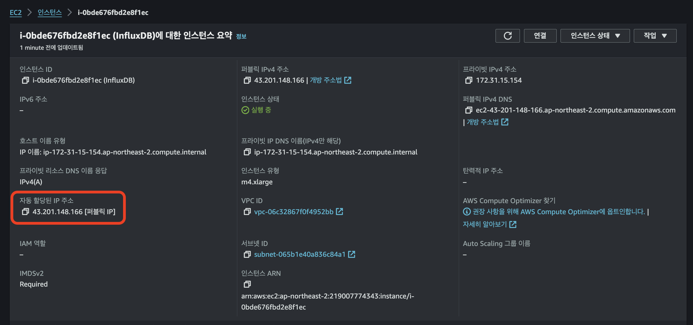

3. 웹 브라우저 (Google Chrome, Safari, ...)에서 복사한 IP주소 + InfluxDB port 번호를 입력하면 InfluxDB 자체에서 제공하는 UI에 접속할 수 있다.
    - InfluxDB의 default port 번호는 `8086`이다.
    - 따라서, 2번에서 복사한 IP 주소가 `43.201.148.166`이라고 할 때, `43.201.148.166:8086`에 접속하면 된다.  

        예시:
        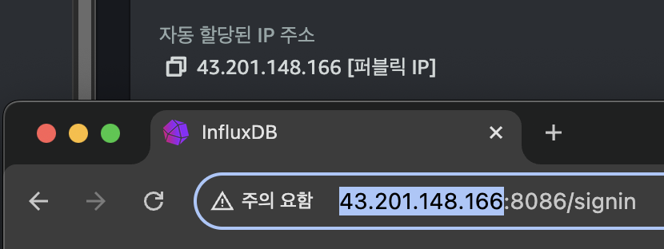

## 추가. Elastic IP Addresses (탄력적 IP 주소)
>`Elastic IP Addresses`를 설정하고 삭제하기 전까지 인터넷에 접속할 수 있는 고정적인 IP 주소를 할당할 수 있는 서비스.

문제점:
- AWS EC2의 Public IP 주소는 매번 껏다 킬때마다 바뀐다.  
- 따라서, 매번 새로운 Public IP 주소를 공유해주어야 한다. 
- 매우 번거롭고 귀찮다.

해결:
- `Elastic IP Addresses (탄력적 IP 주소)`라고 우리가 사용할 IP 주소를 유지하는 것이다 (우리가 제공받은 Elastic IP Address를 할당 해제할 때 까지)

단점:
- 비용이 조금 더 나간다.

특징:
- IPv4만 가능하다.

### 1. 탄력적 IP 주소 생성
1. AWS 서비스 $\rightarrow$ 네트워크 및 보안 $\rightarrow$ 탄력적 IP
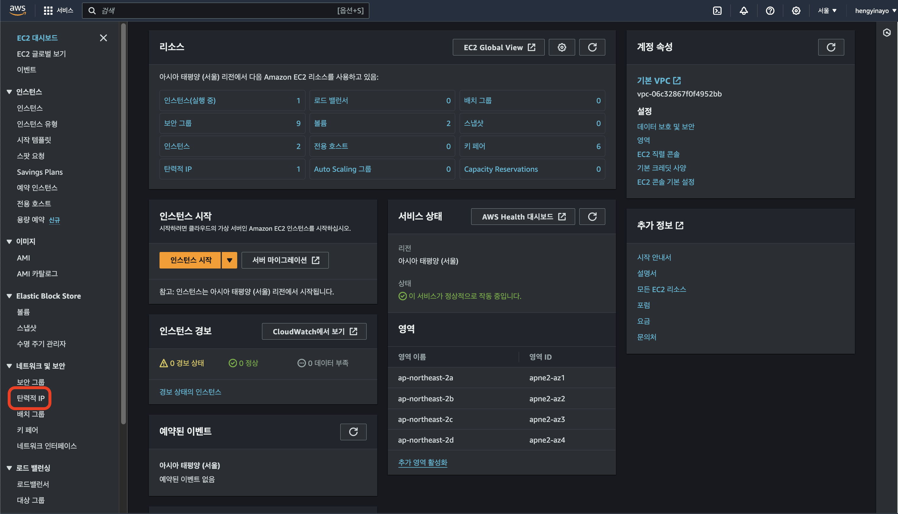

2. `탄력적 IP 주소 할당` 선택
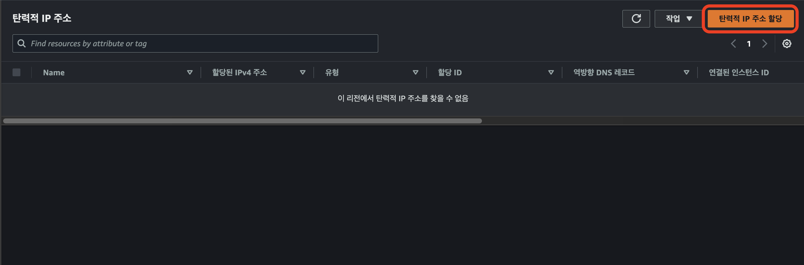

3. 수정 없이, `할당` 선택
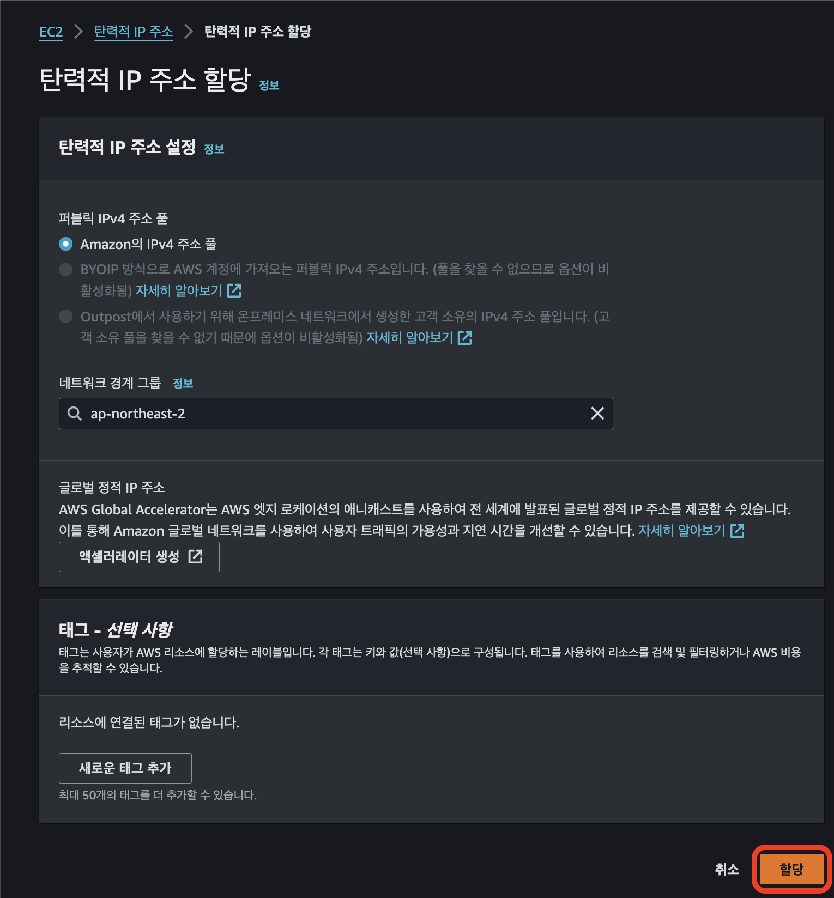

### 2. 탄력적 IP 주소 설정
이제 생성된 EIA (Elastic IP Addresses)를 EC2 인스턴스와 연결시켜주자.

1. 생성된 EIA 선택 $\rightarrow$ 작업 $\rightarrow$ `탄력적 IP 주소 연결` 선택
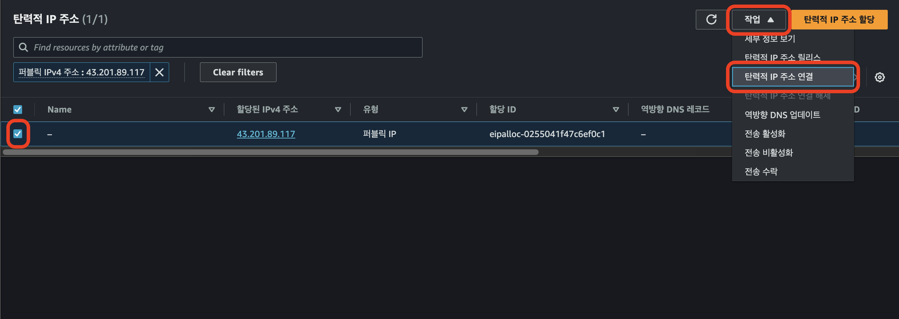

2. 설정해주기
    - 인스턴스 유형: `인스턴스`
    - `인스턴스`와 `프라이빗 IP 주소` 선택 
    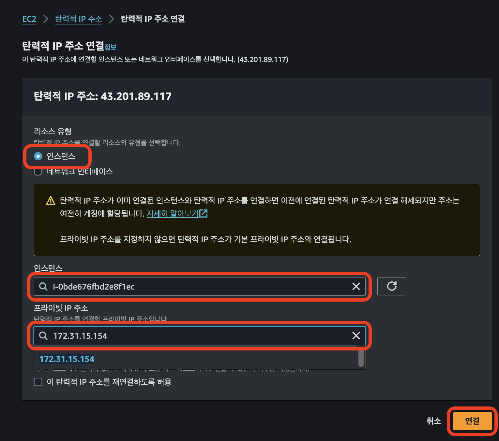

3. EIA를 할당해준 인스턴스 확인하기
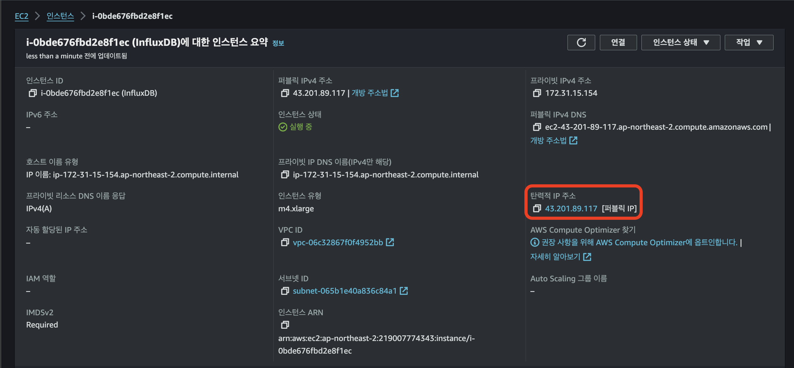
위 사진과 같이, EIA가 할당된 걸 볼 수 있다.

결과:
- 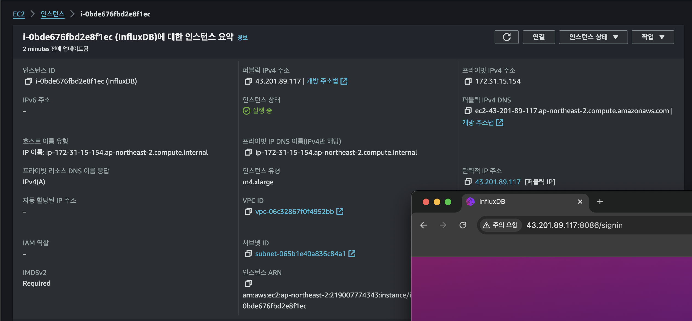

> 삭제하고 싶으면, 1번의 생성된 EIA 선택 $\rightarrow$ 작업 $\rightarrow$ `탄력적 IP 주소 릴리스` 선택
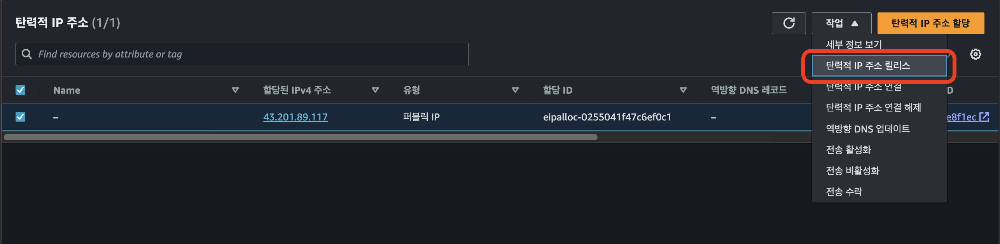